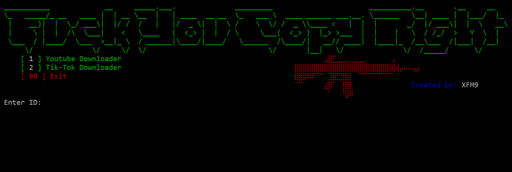

 

 

## YouTube Downloader (yt-dlp)

Console YouTube downloader written in Python using **yt-dlp**.  
Allows downloading videos with resolution selection, audio as MP3, and thumbnails.

## Features
- Download video with selectable resolution
- Download audio and convert to MP3
- Download video thumbnail
- Single video only (playlists disabled)
- Simple console menu
- Colored output (colorama)

## Requirements
- Python 3.9+ (install from https://www.python.org/downloads/)
- ffmpeg (required for audio and video merging)
  - Windows: download from https://ffmpeg.org/download.html
  - Linux: install via `sudo apt install ffmpeg -y`

## Libraries
- sys
- os
- yt_dlp
- colorama
- urllib.parse
